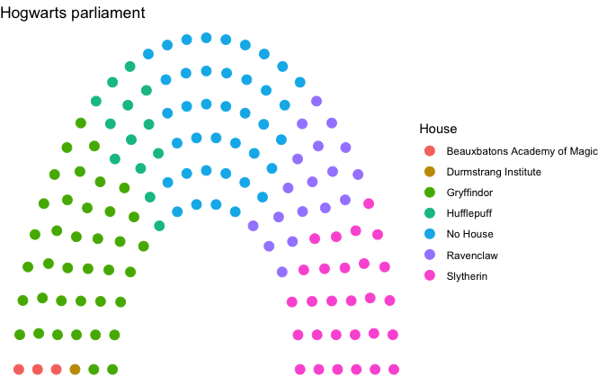
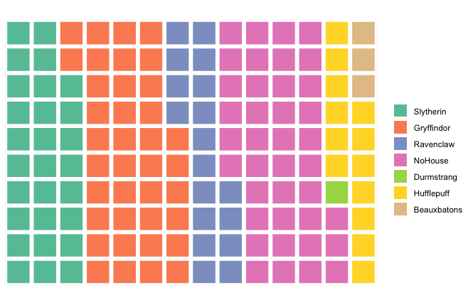
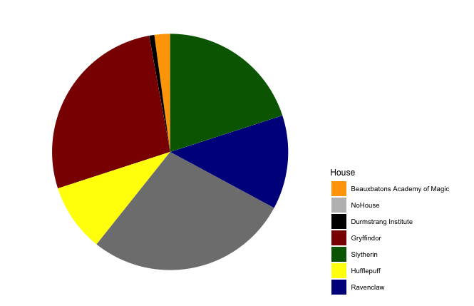
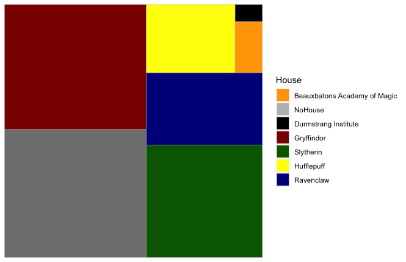
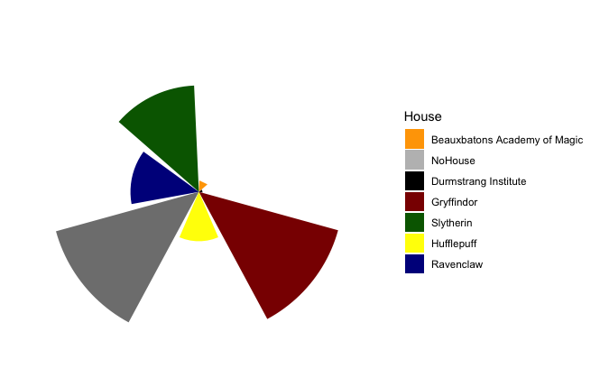
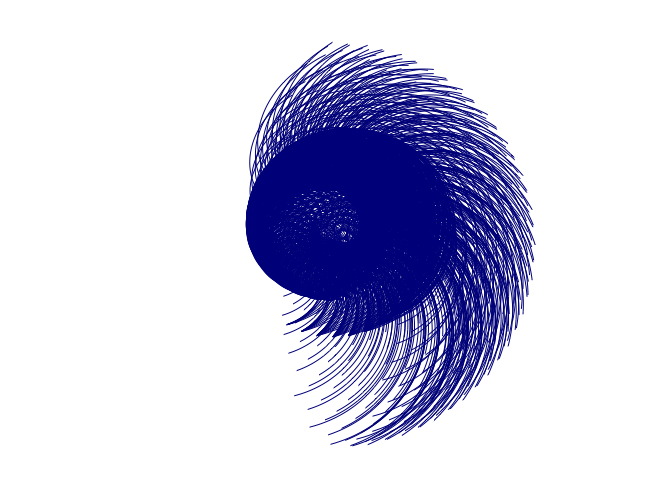

# Impress your coding mates with these _riddikulusly_ magical data visualizations 

#### Created by barbora8


## Tutorial aims:
__1. [Welcome to Hogwarts: Get familiar with less known plots](#welcome-to-hogwarts)__

__2. [Hogwarts house student parliament: parliament chart](#hogwarts-house-student-parliament-parliament-chart)__

__3. Dinner at the Great Hall;__

   - __[Waffle chart](#waffle-chart)__

   - __[Pie chart](#pie-chart)__

__4. [The whomping willow: Tree map](#the-whomping-willow-tree-map)__

__5. [Wingardium leviosa: Word cloud](#wingardium-leviosa-word-cloud)__

__6. [Give your barchart a little magic: Radial barchart](#give-your-barchart-a-little-magic-radial-barchart)__

__7. [BONUS: Visualisation of an actual spell aka Data art](#bonus-visualisation-of-an-actual-spell-aka-data-art)__


Data visualisation is a graphical representation of the data and is an important part of every project. There many different ways how we can visualise our results, some more common than others.

This tutorial is aimed to show and teach all the muggles and wizards who are interested in coding some _siriusly_ cool and less known types of plots you can generate to visualise your results using Rstudio, which despite looking pretty impressive are relatively easy to make and require only basic knowledge of R. If you are a beginner without previous experience with this language, I would recommend looking at these [tutorials](https://ourcodingclub.github.io/tutorials/intro-to-r/) first.

### Welcome to Hogwarts
In this tutorial we will be using a dataset on Harry Potter characters, which is publicly available from this [website](https://www.kaggle.com/gulsahdemiryurek/harry-potter-dataset).

In Rstudio we will import our data and load some general libraries (additional packages needed for specific graphs will be downloaded later in the tutorial). You can of course do a little exploring of your data to get familiar with it.
```
# Load the basic libraries
library(tidyverse)     
library(ggplot2)
library(ggthemes)
```
Note that in the read.csv function below we specify that the columns are separated by ";", we also tell R to replace empty observations with "NA".
```
# Import our data
hp_characters <- read.csv("data/Characters.csv", sep = ";", na.strings = c("","NA"))
```


### Hogwarts house student: parliament parliament chart

First on our list is a parliament chart. Parliament charts are used to visualise seats belonging to different groups we have in our data, usually used for a presentation of election results. In our tutorial we will use the Hogwarts House column to see the distribution of the Harry Potter characters if Hogwarts had a parliament.

 We need a ggparliament extension in the ggplot package. This allows us to plot the parliament in different layouts, such as semicircle, horseshoe, circle, opposing bench or a classroom. Here we will use the classical semicircle parliament.

```
# Load a needed extension, if needed install first
library(ggparliament)

# Creating a subset dataframe of the column of our interest- House, let's call it chr
chr <- hp_characters %>%
  group_by(House) %>%   
  tally() %>%           # Counting characters in each House
  ungroup()             # Good practice to ungroup after grouping

# Create the data frame to be used
semicircle <- parliament_data(election_data = chr,    # Specify data
                              type = "semicircle",    # Parliament type
                              parl_rows = 6,          # Number of rows of the parliament
                              party_seats = chr$n)    # Seats per party

# Plot our chart
ggplot(semicircle, aes(x = x, y = y, colour = House)) +
  geom_parliament_seats() +
  theme_ggparliament() +               # A clean theme for parliament plots
  labs(title = "Hogwarts Parliament")
```
After running the code, the chart will look like this:

<br>

<p align="center">
  
</p>


<br>

### Dinner at the Great Hall

### Waffle chart

Did you know that waffles are great not only for breakfast, but also for visualising your data?

A waffle chart illustrates the data of one or multiple categories. It can be used to compare them, or in the case of one category, to show a progress towards our target.

Now we are going to create a simple waffle chart using the houses of our characters from the hp_characters dataset. We start by loading a waffle package.
   
 
```
# Load the library, install if needed
library(waffle)

# Checking the House categories
unique(hp_characters$House)

# Replacing NAs in our data with "No House"
hp_characters <- hp_characters %>%
  mutate(House = replace_na(House, "No House"))  

# Generating our waffle chart
house_waffle <- waffle(c(Slytherin = 28,
                        Gryffindor = 38,
                        Ravenclaw = 18,
                        NoHouse = 39,
                        Durmstrang  = 1,
                        Hufflepuff = 13,
                        Beauxbatons = 3),
                rows = 10)

house_waffle  # Viewing the waffle
```
                
                
This is our output:

<br>

<p align="center">

</p>
   
### Pie chart

Now let's move to our second course, a pie! Pie charts can be a simple method of presenting your results, but you know what they say: there is beauty in simplicity! And often it is a great choice, as it shows the data in a _siriusly_ nice and clear way.


```
# Creating a pie chart using our chr subset dataframe
ggplot(chr, aes(x= "", y= n, fill=House)) +     # Filling pie with colours
  geom_bar(stat="identity", width=1) +
  coord_polar("y", start=0) +
  theme_map() +                                 # Blank theme for plots
  scale_fill_manual(values= c("Beauxbatons Academy of Magic"= "orange",
                              "NoHouse"="grey",
                              "Durmstrang Institute"="black",
                              "Gryffindor"="darkred",
                              "Slytherin"="darkgreen",
                              "Hufflepuff"="yellow",
                              "Ravenclaw"="darkblue"))+
  theme(legend.position = "right")
```
   
   
You can play a bit with your preferred colours, but this is the graph we get with this code:

<p align="center">

</p> 
   

<br>

### The whomping willow: Tree map

Treemap is an alternative method of visualising the hierarchical structure of our data. Using rectangles assigned to each category it also illustrates its quantity.

Let's make a nice treemap showing the distribution of each of our houses.
   
   
```
# Creating a treemap using our chr subset dataframe
ggplot(chr, aes(fill = House, area = n )) +
  geom_treemap() +
  scale_fill_manual(values= c("Beauxbatons Academy of Magic"= "orange",
                              "NoHouse"="grey",
                              Durmstrang Institute"="black",
                              "Gryffindor"="darkred",
                              "Slytherin"="darkgreen",
                              "Hufflepuff"="yellow",
                              "Ravenclaw"="darkblue"))
```
   
   
Here we can see the output:


<p align="center">

</p>

<br>

### Wingardium leviosa: Word cloud

Now let's give the words some wings an see them fly! A word cloud is a visualisation method that shows how frequent the words are in our data. This is done by the size of each word being proportional to its frequency. We will start by loading the package wordcloud2.
   
   
```
# load the needed library, install if required
library(wordcloud2)

# Let's create a subset dataset for the hair colour of the characters
hair <- hp_characters %>%
  group_by(Hair.colour) %>%
  tally() %>%
  ungroup()

# Creating the basic plot
wordcloud2(data=hair, size=1.6, shape='triangle')
```
   
   
This is our output:

<p align="center">

</p>

<br>

You can get more creative with the plot by choosing the shape, colours or orientation of the text:
   

```
wordcloud2(data=hair, size=1.6, shape='star', color='red', backgroundColor="black")
```
<br>

### Give your barchart a little magic: Radial barchart

Bar-charts can get a bit boring. In wizards' world we add a little pinch of magic to them to make them look more fascinating. Here we will turn a usual boring bar-chart into a radial/circular one.

```
# Creating a radial bar-chart
ggplot(chr, aes(x = House, y = n, fill = House)) +
  geom_bar(stat = "identity") +
  coord_polar(start = 0) +
  theme_bw() +
  theme(axis.text.x = element_blank(),
        axis.title.x = element_blank(),
        axis.ticks = element_blank(),
        panel.border = element_blank(),
        panel.grid = element_blank(),
        axis.text.y = element_blank(),
        axis.title.y = element_blank()) +
  scale_fill_manual(values= c("Beauxbatons Academy of Magic"= "orange","NoHouse"="grey","Durmstrang Institute"="black", "Gryffindor"="darkred", "Slytherin"="darkgreen", "Hufflepuff"="yellow", "Ravenclaw"="darkblue"))
```
   
   
This is the chart we get:

<br>

<p align="center">

</p>

<br>

As you can see in the code above, setting a theme like this takes a lot of time and is not very efficient, especially if you use it often. In that case, it is more practical to create a custom theme. You can do this by assigning it a name and using the function() command to specify the different aspects of the theme such as whether axes labels appear, if they do their size and style. Then, when you are plotting your graphs, you can add your custom theme as a layer in ggplot.

```
# Creating a theme
blank_theme <- function() {
  theme(axis.text.x = element_blank(),
        axis.title.x = element_blank(),
        axis.ticks = element_blank(),
        panel.border = element_blank(),
        panel.grid = element_blank(),
        axis.text.y = element_blank(),
        axis.title.y = element_blank())
}
```


### BONUS: Visualisation of an actual spell aka Data art

Did you know that even muggles can see spells? Thanks to R, we can now visualise even more abstract things from the wizards' world. This bonus graph is a tricky one, well beyond the basic knowledge of coding, so I won't go into any deep details, but the output is remarkably impressive, so feel free to copy the code, maybe play a bit with the colours and enjoy!
               

```
par(mfrow=c(1,1),mar=c(0,0,0,0),oma=c(1,1,1,1))
plot(0,0,type="n", xlim=c(-2,32), ylim=c(3,27),
     xaxs="i", yaxs="i", axes=FALSE, xlab=NA, ylab=NA,
     asp=1)

for (j in 0:35) {
  for (i in 0:35) {

    R <- 8
    alpha <- j*10
    X <- 15+R*cos(alpha/180*pi)
    Y <- 15+R*sin(alpha/180*pi)

    r <- 3
    beta <- i*10
    x <- 15+r*cos(beta/180*pi)
    y <- 15+r*sin(beta/180*pi)

    d1 <- sqrt((X-x)^2+(Y-y)^2)
    xc <- x
    yc <- y

    n <- 180-atan((Y-y)/(X-x))/pi*180

    alpha2 <- -(0:n)
    theta <- alpha2/180*pi

    b <- d1/(n/180*pi)
    r <- b*theta

    x1 <- xc+r*cos(theta)
    y1 <- yc+r*sin(theta)

    lines(x1,y1, col="blue")

  }
}
```

And this is how magical our output looks like:

<br>

<p align="center">

</p>

<br>
   
I hope you enjoyed the tutorial! If you have any questions, please send me an owl or if you are a muggle, contact me at:
barbora.ebringerova@gmail.com
